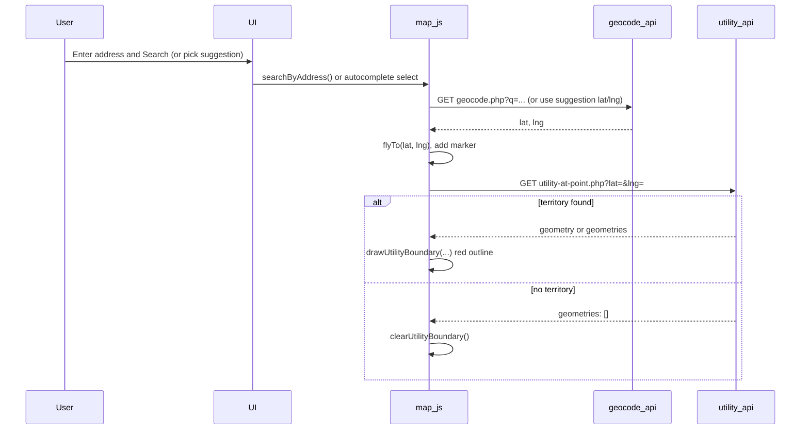

# Plan: Red-outlined utility area polygon for searched address

## Goal

After the user searches by address (or selects an address from autocomplete), show a **red-outlined polygon** on the map indicating the electric utility service territory that contains that point. If no territory data exists for the location, show nothing (no error required).

---

## Overview

1. **Backend:** Restore an API that, given `lat` and `lng`, returns the boundary geometry (and optionally utility name) for the territory containing that point. Data comes from local [data/territories.json](data/territories.json) and/or HIFLD (with cache).
2. **Frontend:** After a successful address search (geocode or autocomplete selection), call that API; if geometry is returned, draw it as a red-outlined polygon (and clear any previous polygon on the next search).

---

## 1. Backend

### 1.1 Restore territory loading (territories_loader.php)

Re-add [api/territories_loader.php](api/territories_loader.php) with **only** the logic needed for “territory at point” (no name search):

- **`get_territories_for_bbox($west, $south, $east, $north)`**  
  - Try cache (e.g. `data/cache/territories/` by bbox key, TTL 24h).  
  - If miss, call HIFLD MapServer query by envelope (geometryType `esriGeometryEnvelope`, `f=geojson`), then cache and return features.  
  - On HIFLD failure, return `null`.
- **`get_local_territories()`**  
  - Read [data/territories.json](data/territories.json); return `features` array (or `[]` if missing/invalid).
- **`feature_geometry($feature)`**  
  - Return `$feature['geometry']` (Polygon or MultiPolygon).
- **`feature_utility_name($feature)`**  
  - Return `NAME` or `name` from properties (optional; useful for tooltip or future UI).

Remove any `fetch_territories_from_hifld_by_name` (or similar) used only for utility-by-name search.

Reference: HIFLD layer URL (from previous implementation):

`https://maps.nccs.nasa.gov/mapping/rest/services/hifld_open/energy/MapServer/26/query`  
with params: `where=1=1`, `geometry` (envelope JSON), `geometryType=esriGeometryEnvelope`, `inSR=4326`, `spatialRel=esriSpatialRelIntersects`, `returnGeometry=true`, `outFields=*`, `outSR=4326`, `f=geojson`.

### 1.2 Restore utility-at-point API (utility-at-point.php)

Re-add [api/utility-at-point.php](api/utility-at-point.php):

- **Input:** `GET ?lat=...&lng=...` (required, valid ranges).
- **Logic:**
  - Build a bbox around the point (e.g. ±0.4° margin).
  - Call `get_territories_for_bbox(...)`; if `null`, fall back to `get_local_territories()`. Set `territory_source` to `'hifld'` or `'local'`.
  - Iterate features; for each, get geometry (Polygon or MultiPolygon) and run **point-in-polygon** (ray-casting) for `[lng, lat]`. For MultiPolygon, check any part; collect all polygons for that feature for drawing.
  - First feature that contains the point: return JSON  
    `{ "utility", "utility_id", "geometry", "geometries", "territory_source" }`  
    (and optionally `bbox`). Use same response shape as before so the frontend can use `geometry` or `geometries` (array of Polygon geoms).
  - If no feature contains the point: return  
    `{ "utility": null, "geometry": null, "geometries": [], "territory_source": "...", "code": "no_utility_at_point" }`.

Reuse the previous **point-in-polygon** and bbox helper logic from the deleted file (no need to change algorithm).

---

## 2. Frontend

### 2.1 Map JS (assets/map.js)

- **State:** Add a single layer variable, e.g. `utilityBoundaryLayer`, to hold the current red polygon layer (or layer group).
- **Style:** Define a red-outline style, e.g.  
  `color: '#c00'` (or `'#e74c3c'`), `weight: 2.5`, `opacity: 0.9`, `fillColor: 'transparent'` (or very light red with low `fillOpacity` if you want a subtle fill).
- **`drawUtilityBoundary(geometryOrGeometries)`**  
  - Remove existing `utilityBoundaryLayer` from the map if present.  
  - Normalize input to an array of Polygon geometries (single Polygon → one-element array; `geometries` array → use as-is).  
  - Create a `L.layerGroup()`, and for each geometry add a GeoJSON feature with the red style; add the group to the map and store in `utilityBoundaryLayer`.
- **`clearUtilityBoundary()`**  
  - Remove and clear `utilityBoundaryLayer` when there is no territory to show (e.g. before a new search or when API returns no geometry).
- **Integration with address search:**
  - In **`searchByAddress()`** (and in the **autocomplete selection** path where you call `flyTo(lat, lng)`): after successfully zooming to the point, call  
    `GET api/utility-at-point.php?lat=...&lng=...`.  
  - If the response has `geometry` or a non-empty `geometries` array, call `drawUtilityBoundary(geometry || geometries)`.  
  - Otherwise call `clearUtilityBoundary()`.  
  - Do not block the map zoom or marker on this; the polygon can load shortly after. Optionally disable the search button only until geocode completes, not until territory loads.

No UI text is required for “no territory” (e.g. no error message); just omit the polygon.

### 2.2 No HTML/CSS changes

No new elements or CSS are required; the polygon is drawn entirely in Leaflet.

---

## 3. Data and cache

- **data/territories.json**  
  - Already exists; structure is GeoJSON FeatureCollection with `features[]`; each feature has `geometry` (Polygon) and `properties` (e.g. `name`, `id`). Keep as the local fallback when HIFLD is unavailable.
- **data/cache/territories/**  
  - Create on first HIFLD request; store bbox-cached GeoJSON (e.g. `{ "features": [...] }`) with a TTL (e.g. 24 hours).

---

## 4. Flow summary

---

## 5. Optional later enhancements

- Show utility name in a small tooltip or sidebar when a polygon is shown.
- If the polygon is very large, optionally fit the map view to both the marker and the polygon bounds (e.g. `flyToBounds` with padding) so the user sees the full service area.
