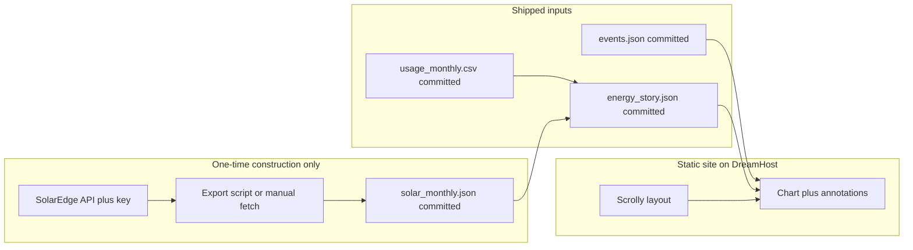

# Scrollytelling home energy + life story (DreamHost static, point-in-time)

## What you chose (constraints)

- **Host**: Public site on DreamHost as a custom, polished web page (static upload).
- **Time range**: From move-in through the **snapshot end date** you choose when you freeze the story (point-in-time, not a living dashboard).
- **Usage data**: **Monthly** consumption from CSV/Excel.
- **Solar**: SolarEdge API used **only during initial construction** to create a **checked-in JSON snapshot**; the shipped site does **not** fetch SolarEdge on load or on every build.
- **Privacy**: Prefer **month/year or season** labels on sensitive milestones in public copy.
- **Events**: A single human-editable data file in the repo. For a **no-Node** workflow, prefer `**events.json`** (or edit JSON generated once from a spreadsheet export). **YAML** remains fine if you use a one-off converter or optional local tooling.

## DreamHost and Node (clarification)

DreamHost static hosting **does not need Node on the server** and never did: you upload HTML, CSS, JS, and JSON. The earlier plan's "build" step runs **on your computer** (or not at all), then you upload the folder.

Because you want to avoid relying on Node, the recommended path is:

- **Primary stack**: **Vanilla HTML + CSS + JavaScript**, with **D3** and **Scrollama** loaded from a **CDN** (or vendored `.js` files next to your HTML). No npm required to **publish**—only a browser to test locally before upload.
- **Optional**: Use **Vite** or similar **only if** you want TypeScript, bundling, or minification on your machine; output is still plain static files for DreamHost. This is optional, not required.

## Architecture (snapshot data only)

**Critical rules**:

- The API key is used **only** in the one-time export step on a trusted machine; it is **never** embedded in the public site.
- Routine edits to the story = edit JSON/CSV/copy and **re-upload** static files—**no** SolarEdge calls.

## Data pipeline

1. **Normalize your CSV** to a small contract, e.g. columns: `period_start` (ISO date), `period_end` (optional), `grid_kwh` (number). Map your real column names once (documented in README).
2. **SolarEdge (once)**: Call the appropriate energy/history endpoint for your site; aggregate to **monthly kWh** aligned with your usage buckets; save as `**data/solar_monthly.json`** and commit it. Tools: **Postman**, `**curl`**, or a **small Python script** (no Node required).
3. **Merge (once per edition)**: Combine CSV + `solar_monthly.json` into `**data/energy_story.json`** (outer join on year-month). Pre-solar months = `null` or zero with narrative "before solar." This merge can be a **manual step in a spreadsheet** exported to JSON, or a **one-off Python script**—not part of every deploy.
4. **Derived overlays**: Seasons and travel bands can be computed in browser from dates in `energy_story.json` / `events.json`, or precomputed into the JSON for simplicity.

## Events model (narrative-first)

In `**data/events.json`** (recommended for no-Node), each item might include:

- `slug`, `title`, `body` (short paragraph for the scroll section)
- `anchor`: `year-month` (e.g. `2019-06`) or coarse labels for fuzzy anchors
- `sensitivity`: `public` vs `soft` (copy uses "that summer" / month+year only for soft)
- Optional `end` for travel or multi-month phases

Scroll order follows this file. Charts annotate at the approximate x-position from `anchor`.

## Front-end / scrolly pattern

- **Scrolling**: **Scrollama** (CDN) + **IntersectionObserver** pattern for a **sticky chart** while text steps advance.
- **Charts**: **D3** (CDN) — monthly dual series (grid use vs solar production) plus markers / shaded bands for events and travel. Restrained editorial typography and color for polish.
- **Responsive**: Sticky side-by-side on wide screens; stacked layout on narrow screens.

## DreamHost deploy

- Upload the site folder (e.g. `index.html`, `css/`, `js/`, `data/*.json`) to `public_html` or your subdomain directory. No interpreter or Node on the host.

## Content workflow (point-in-time "editions")

1. **First edition**: Export solar snapshot → merge → polish narrative → upload.
2. **Later, if you want a new chapter** (optional): Re-run the one-time solar export with a new end date, re-merge, bump copy, upload—still not a live API on the site.

## Open details you'll supply when implementing (not blockers for the plan)

- Exact CSV column names and whether periods are calendar months or utility billing cycles.
- **Snapshot end** month (the "as of" date for the story).
- Final list of events with preferred public vs soft wording.

## Risks / notes

- **SolarEdge history depth**: Confirm how far back a one-time export can go; fill gaps manually if needed.
- **Alignment**: If billing months are mid-month, monthly buckets should follow **billing**, not calendar months, so the chart matches your bills.
